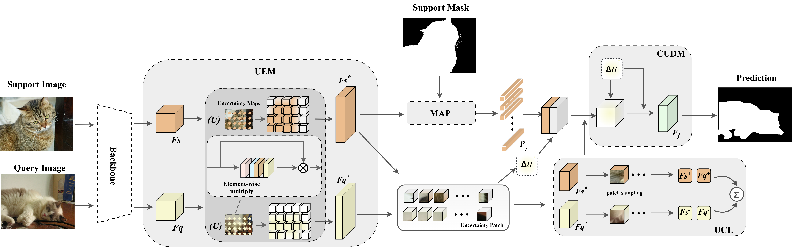

# UCGNet:Uncertainty Contrastive Guidance for Robust Few-Shot Semantic Segmentation
This repo contains the code for our paper "Uncertainty Contrastive Guidance for Robust Few-Shot Semantic Segmentation" by Fangfang Song,Mingxing Huang,Qi li

> **Abstract:** *Few-Shot Semantic Segmentation (FSS) aims to achieve pixel-level dense prediction using limited annotated samples. However, FSS models are highly susceptible to feature uncertainty and domain shift. This susceptibility often degrades their robustness. Existing methods rarely model the reliability of fine-grained features explicitly. This limitation leads to noisy feature matching and sub-optimal generalization.To address these issues, we propose an Uncertainty-Contrastive Guided Network (UCGNet). UCGNet integrates three key components. These are the Uncertainty Estimation Module (UEM), the Cross-set Uncertainty-guided Differential Matching module (CUDM), and the Uncertainty Contrastive Loss (UCL). Together, they effectively suppress low-reliability noise and enhance discriminative target features.We conducted extensive experiments on the PASCAL-$5^i$ and COCO-$20^i$ datasets. Our method outperforms existing state-of-the-art approaches under both 1-shot and 5-shot settings. Specifically, it yields average mIoU improvements ranging from 2.18\% to 4.73\%. This work presents a general uncertainty-aware paradigm. It effectively improves FSS performance in complex scenarios. *

##Code will be released soon.

## Overview

## Get Started 
### Dependencies

- Python 3.8
- PyTorch 1.7.0
- cuda 11.0
- torchvision 0.8.1
- tensorboardX 2.14

### Datasets

- PASCAL-5i:  [VOC2012](http://host.robots.ox.ac.uk/pascal/VOC/voc2012/) + [SBD](http://home.bharathh.info/pubs/codes/SBD/download.html)

- COCO-20i:  [COCO2014](https://cocodataset.org/#download)

- We follow the lists generation as BAM and upload the Data lists into './lists'
- Run `util/get_mulway_base_data.py` to generate base annotations for **stage1**.

- ### Scripts

- Change configuration via the `.yaml` files in `config`, then run the `tain.sh` and 'test.sh' for training and testing.
